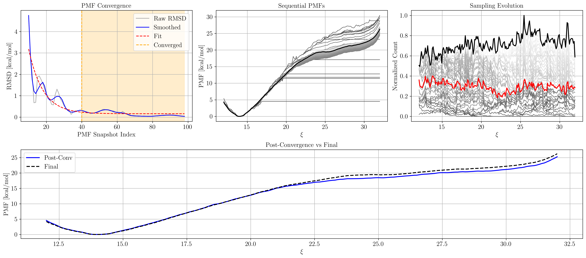

A command-line tool for generating PMF convergence and comparison plots from trajectory data. It visualizes RMSD convergence, sequential PMFs, sampling evolution, and post-convergence vs final PMF profiles.

Features
- Convergence detection with adjustable RMSD threshold
- Control over number of post-convergence snapshots
- Toggle minima/maxima/barrier annotations on or off
- Customize font sizes for axes and annotations
- Save figures in PNG, PDF, or other formats at specified DPI

Requirements
- Python 3.6 or higher
- NumPy
- Scipy
- Matplotlib
Install dependencies with pip:
pip install numpy matplotlib


Usage
Run the script with your PMF and sampling counts files as positional arguments. The PMF and counts files must contain a history of the simulation and not just the final PMF/counts:

 ```bash
python analyze.py pmf.hist.czar.pmf counts.hist.count [OPTIONS]
``` 


## Command-Line Options

| Flag                 | Type    | Default | Description                                                                 |
|----------------------|---------|---------|-----------------------------------------------------------------------------|
| --font-size          | int     | 14      | Base font size (pt) for titles, labels, ticks                               |
| --annotation-fs      | int     | None    | Font size (pt) for annotation text; falls back to --font-size               |
| --no-annotations     | boolean | True    | Disable all minima/maxima/barrier annotations                               |
| --save-path          | str     | None    | File path (with extension) to save the figure                               |
| --dpi                | int     | 300     | Resolution (dots per inch) for the saved figure                             |
| --conv-threshold     | float   | 0.01    | RMSD cutoff (Å) below which convergence is declared                         |
| --n-recent           | int     | 10      | Number of PMF snapshots to average for RMSD calculation, sliding window size |
| --use-final-rmsd     | boolean | False   | Calculate RMSD with respect to the final frame instead of sliding window    |
| --counts-std-thresh  | flaot   | None    | Add a convergence criterium based on the standard deviation of the sampling |


Examples
- Generate a quick plot with default settings:
 ```bash
python analyze.py pmf.hist.czar.pmf counts.hist.count
```
- Increase text size and save as a high-res PNG:
```bash
python analyze.py pmf.hist.czar.pmf counts.hist.count \
  --font-size 16 \
  --save-path pmf_overview.png \
  --dpi 600
```
- Set a stricter convergence threshold and compare 5 snapshots post-conv:
```bash
python analyze.py pmf.hist.czar.pmf counts.hist.count \
  --conv-threshold 0.001 \
  --n-recent 5 \
  --save-path pmf_report.pdf
```
- Disable annotations for a cleaner overlay:
```bash
python analyze.py pmf.hist.czar.pmf counts.hist.count --no-annotations
```

